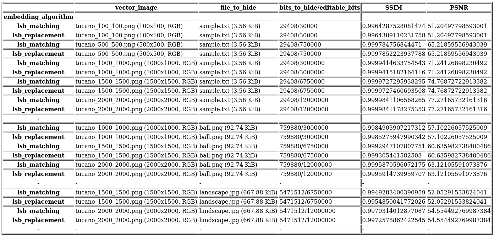

# Stego Tool

This is the project realized for the exam of the subject "Multimedia e Laboratorio" (University of Catania, Computer Science Department).

# How to start this project?

1. Install Python 3 (project developed using Python 3.8.10).
2. Run `pip install -r requirements.txt` in main project directory.
3. Run `python3 iface.py` in main project directory.
4. Enjoy!

# Core functionality working scheme

### Embedding phase:

  

### Retrieval phase:

  

# Benchmarking

  

